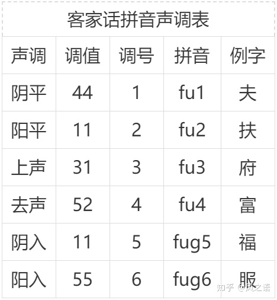
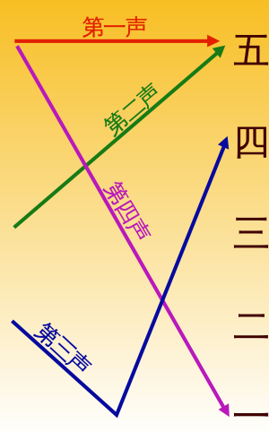

# 灿语简介

Lingvolcan是以voliucano发音为基础，辅以广韵、平水韵对齐汉字的语言。是汉语-客家语-灿语分支。目前母语掌握人数1人。

## 音标

#### 声母：

注意 [疑母 ng](https://zh-yue.wikipedia.org/wiki/%E7%96%91%E6%AF%8D)：

* 可以考虑在发完 后鼻音ang之后接生母
* 

普通话-Can语对照表

* | 普通话 | Can语拼音 | 示例     |
  | ------ | --------- | -------- |
  | l      | d         | 两刘     |
  | f      | p         | 发饭     |
  | b      | p         | 病       |
  | x      | h         | 溪闲鞋行 |
  | x      | s         | 西洗谢性 |
  | y      | ng        | 月鱼涯   |
  | q      | j         | 其       |
  | ji     | g         | 家角降   |
  | r      | ng        | 入日热肉 |
  | r      | l         |          |
  | yu-    | vi-       | 圆云     |
  | yu-    | ngi-      | 缘       |
  | ru-    | ngi-      | 软       |
  |        |           |          |
  |        |           |          |
  |        |           |          |
  |        |           |          |
  |        |           |          |

#### 韵母

[平水韵](http://xh.5156edu.com/page/z4750m8331j20371.html)

## 音调

[入声](https://baike.baidu.com/item/%E5%85%A5%E5%A3%B0%E5%AD%97/762666)

五度音标法：

通过do re mi so la

“宫、商、角、徵、羽”（读音为gōng shāng jué zhǐ yǔ）是我国五声音调中五个不同音的名称，类似现在简谱中的1、2、3、5、6。即宫等于1(Do)，商等于2(Re)，角等于3(Mi)，徵等于5(So)，羽等于6(La)，亦称作五音。

| 声调 | 调值 | 普通话 |    |
| ---- | ---- | ------ | -- |
| 阴平 | 24   | 55     | 夫 |
| 阳平 | 11   | 35     |    |
| 上声 | 31   | 214    |    |
| 去声 | 453  | 51     |    |
| 阴入 | 3    | -      |    |
| 阳入 | 5    | -      |    |

入声表: 平水韵 -

|            | 屋 | 沃    | 觉 | 质 | 物   | 月 |  |  |  |  |
| ---------- | -- | ----- | -- | -- | ---- | -- | - | - | - | - |
| Can语拼音  | ek | uuk   | ok | et | eit  |    |  |  |  |  |
| 普通话拼音 | u  | uo/u  | ue | i  |      |    |  |  |  |  |
| 例子       |    | 足/浴 |    | 失 | 物佛 |    |  |  |  |  |
|            |    |       |    |    |      |    |  |  |  |  |
|            |    |       |    |    |      |    |  |  |  |  |
|            |    |       |    |    |      |    |  |  |  |  |
|            |    |       |    |    |      |    |  |  |  |  |

平水韵 - 普通话 - Can语对照表

| 平水韵                                         | 平水韵 | 普通话 | 灿语 | 例字   |  |
| ---------------------------------------------- | ------ | ------ | ---- | ------ | - |
| [一屋](https://sou-yun.cn/QR.aspx?ct=%e5%b1%8b)   | -uk    | u      | ek   | 目淑   |  |
| [二沃](https://sou-yun.cn/QR.aspx?ct=%e6%b2%83)   | -uuk   | uo     | uuk  | 浴玉肉 |  |
| [三觉](https://sou-yun.cn/QR.aspx?ct=%e8%a7%89)   | -eok   | ue     | ok   | 觉学   |  |
| [四质A](https://sou-yun.cn/QR.aspx?ct=%e8%b4%a8)  | -it    | i      | it   | 日笔   |  |
| [四质B](https://sou-yun.cn/QR.aspx?ct=%e8%b4%a8)  | -it    | u      | eit  | 出     |  |
| [五物](https://sou-yun.cn/QR.aspx?ct=%e7%89%a9)   | -ot    | u      | et   | 物佛   |  |
| [六月](https://sou-yun.cn/QR.aspx?ct=%e6%9c%88)   | -jat   |        | iet  | 月     |  |
| [七曷](https://sou-yun.cn/QR.aspx?ct=%e6%9b%b7)   | -at    |        |      |        |  |
| [八黠](https://sou-yun.cn/QR.aspx?ct=%e9%bb%a0)   | -aet   |        |      |        |  |
| [九屑](https://sou-yun.cn/QR.aspx?ct=%e5%b1%91)   | -et    |        |      |        |  |
| [十药](https://sou-yun.cn/QR.aspx?ct=%e8%8d%af)   | -ak    |        |      |        |  |
| [十一陌](https://sou-yun.cn/QR.aspx?ct=%e9%99%8c) | -eak   |        |      |        |  |
| [十二锡](https://sou-yun.cn/QR.aspx?ct=%e9%94%a1) | -ek    |        |      |        |  |
| [十三职](https://sou-yun.cn/QR.aspx?ct=%e8%81%8c) | -jik   |        |      |        |  |
| [十四缉](https://sou-yun.cn/QR.aspx?ct=%e7%bc%89) | -ip    |        |      |        |  |
| [十五合](https://sou-yun.cn/QR.aspx?ct=%e5%90%88) | -op    |        |      |        |  |
| [十六叶](https://sou-yun.cn/QR.aspx?ct=%e5%8f%b6) | -ep    |        |      |        |  |
| [十七洽](https://sou-yun.cn/QR.aspx?ct=%e6%b4%bd) | -aep   |        |      |        |  |

阴平 肤
阳平 浮

上： 府

去：富

入：福

## 常用字

| 汉字 | Can 语拼音 | 发音(以普通话标注) | 含义        |
| ---- | ---------- | ------------------ | ----------- |
| 尔   | han        | 含                 | 你          |
| 吾   | ngaa       |                    | 我          |
| 其   | jii        |                    | Ta          |
| 系   | hai        | 害                 | 是          |
| 行   | hɑng      | 航                 | 走路        |
| 走   | zae        | 皂                 | 跑步        |
| 食   | sheit      |                    | 吃          |
| 饭   | phuɑn     |                    | 饭          |
| 翼   | yit        |                    | 翅          |
| 月   | ngiet      | 捏                 | 月亮        |
| 疾   | jiot       |                    | (走得)快    |
| 病   | piɑng     | 皮昂               | 病          |
| 无   | en         | 嗯                 | 没          |
| 饥   | jii        | 机                 | 饿          |
| 屑   | siot       |                    | （面/米）粉 |
|      |            |                    |             |

一般而言，语气词使用文言。

| 汉字 | Can 语拼音 | 含义 |
| ---- | ---------- | ---- |
| 矣   | ai / ei    | 了   |
| 矣无 | ei mu      | 了没 |
| 成   | shong      | 完   |
|      |            |      |

[微软tts](https://learn.microsoft.com/zh-cn/azure/cognitive-services/speech-service/speech-synthesis-markup?tabs=csharp#use-phonemes-to-improve-pronunciation)

## 常用语

| 汉字           | Can 语拼音        | 发音(以普通话标注) | 例句 |
| -------------- | ----------------- | ------------------ | ---- |
| 巴掌           | bɑ zi yi jiet    | 八子一截           |      |
| 胖桶（玉米卷） | Pɑng Teng        | 攀桶               |      |
| 拳头股         | chien tae gu      | 前掏kio            |      |
| 月             | ngiet             | 捏                 |      |
| 乐             | yok               | 哟                 |      |
| 食矣好疾       | shet yi hoo jiot  | 吃得很快           |      |
| 今朝好寒       | jin zhae huu huon | 今天很冷           |      |
| 昼边           | jiuu bien         | 中午               |      |
| 囊蜺            |                   | 蜻蜓                 |      |
|                |                   |                    |      |
|                |                   |                    |      |
|                |                   |                    |      |
|                |                   |                    |      |
|                |                   |                    |      |
|                |                   |                    |      |
|                |                   |                    |      |
|                |                   |                    |      |
|                |                   |                    |      |
|                |                   |                    |      |
|                |                   |                    |      |
|                |                   |                    |      |
|                |                   |                    |      |

# 

# 囊蜺

# 囊蜺

# 囊蜺

# 囊蜺

# 囊蜺

# 囊蜺

# 囊蜺仔

# 囊蜺仔
